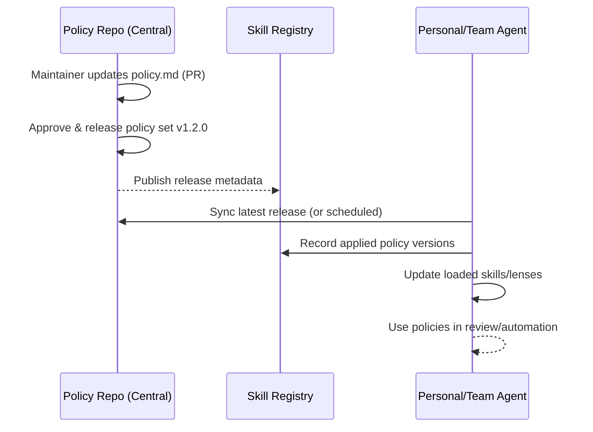

# Central Policy Push → Personal Agent Sync → Skill Registry (Architecture)

## Goal
- Company policies, norms, and guidelines are distributed centrally as **Markdown**.
- Each personal/team agent syncs and references them automatically.
- Skills (checklists/rules/lenses) stay aligned with the latest policy set.

---

## Components (3)

### 1) Policy Repo (Central)
- Version-controlled repository of policies
- Policies are Markdown (+ metadata)
- Has approval + release units

Suggested structure:
- `policies/` (security/quality/legal/brand)
- `lenses/` (UX/QA/Sec/Legal review lenses)
- `skills/` (generic shared skill templates; domain IP stays private)

### 2) Agent Sync (Personal/Team)
- Agents pull the latest policy release (or on schedule)
- Records which versions are applied/loaded
- Has conflict-resolution rules (central vs local overrides)

### 3) Skill Registry (State/Audit)
- Tracks: who applied what policy set/version and when
- Enables audit, rollback, and policy A/B experiments

---

## Minimal data model

### Policy frontmatter example
```yaml
type: policy
id: policy.security.data-handling
version: 1.2.0
owner: Security
scope: [HS, LY]
effectiveDate: 2026-03-23
supersedes: policy.security.data-handling@1.1.0
```

### Agent apply record example
```json
{
  "agentId": "junghoon-personal",
  "policySet": "HS-core",
  "applied": [
    {"id": "policy.security.data-handling", "version": "1.2.0"},
    {"id": "lens.ux.prd-review", "version": "0.3.0"}
  ],
  "appliedAt": "2026-03-23T05:30:00Z"
}
```

---

## Flow (sequence)



---

## Conflict resolution (recommended)
- Central policy acts as **must** rules
- Local customization is **may** rules (team/personal optimization)
- On conflict:
  1) Central must wins
  2) Local may can override only with audit trail

---

## Education becomes distribution
Instead of gathering people for training, distribute Markdown policies centrally and let agents read/execute them.

---

## Next implementation wedge (small start)
- PRD wedge + 1 UX lens
- Release `lens.ux.prd-review@0.1.0` centrally
- Agents sync and apply it to reviewer outputs automatically
